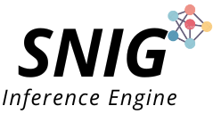

---
title:
layout: default
permalink: /projects/
published: true
---

## Projects

#### Taskflow: A General-purpose Parallel and Heterogeneous Task Programming System
<!---->

&nbsp;&nbsp;
&nbsp;&nbsp;
&nbsp;&nbsp;
&nbsp;&nbsp;
**Taskflow** helps C++ developers quickly write parallel and heterogeneous programs 
&nbsp;&nbsp;&nbsp;&nbsp;&nbsp;&nbsp;&nbsp;&nbsp;&nbsp;&nbsp;&nbsp;with high performance and simultaneous high productivity.

&nbsp;&nbsp;
&nbsp;&nbsp;
&nbsp;&nbsp;
&nbsp;&nbsp;
&nbsp;&nbsp;
<a href="https://github.com/dian-lun-lin/SNIG">

Repository
</a>

#### RTLflow: A GPU Acceleration Flow for RTL Simulation with Batch Stimulus

&nbsp;&nbsp;
&nbsp;&nbsp;
&nbsp;&nbsp;
&nbsp;&nbsp;
**RTLflow** helps circuit designers quickly simulate RTL designs using &nbsp;&nbsp;&nbsp;&nbsp;&nbsp;&nbsp;&nbsp;&nbsp;&nbsp;&nbsp;automatically 
generated C++ and CUDA code on a high-throughput GPU platform.

&nbsp;&nbsp;
&nbsp;&nbsp;
&nbsp;&nbsp;
&nbsp;&nbsp;
<a href="https://github.com/dian-lun-lin/SNIG">

Repository
</a>

#### SNIG: Large Sparse Neural Network Inference using Task Graph Parallelism

&nbsp;&nbsp;
**SNIG** is the Champion-Award inference engine of the 2020 IEEE/MIT/Amazon HPEC Graph Challenge for Large Sparse Neural Network.

&nbsp;&nbsp;
<a href="https://github.com/dian-lun-lin/SNIG">

Repository
</a>

